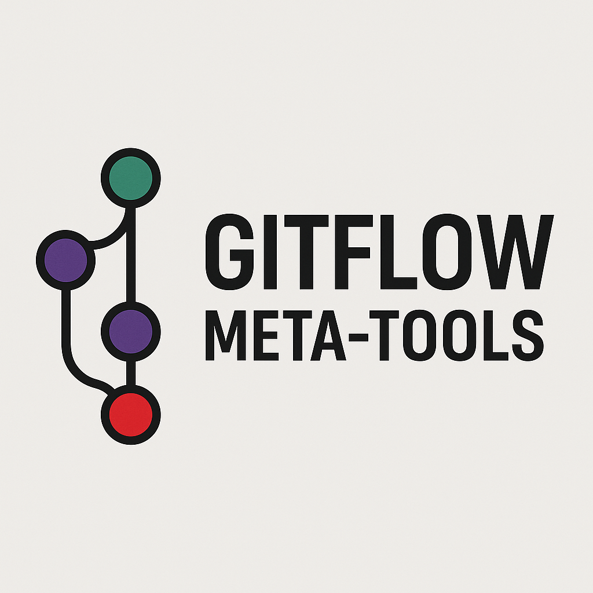

# GitFlow Meta Tools

<p align="center">
  
</p>

🔧 A modular toolkit for automating, managing, and scaling Git-based CI/CD workflows.

## 🎯 Purpose

This project is built for developers and devops engineers to:
- Automate versioning and changelog management
- Build and share reusable git/CI helpers
- Collaborate on branching, tagging, and release strategies
- Open source a culture of operational GitOps intelligence

## 🚀 What's Inside

- `scripts/`: CLI tools like `tag-release.sh` and changelog appenders
- `workflows/`: GitHub Actions, reusable pipelines
- `examples/`: Sample CI logic, git hook usage
- `community/`: Contributor roles and strategy maps

## 🔂 Dynamic Use Paths

We believe in role-based evolution:
- 🛠 Contributors build tools
- 🔭 Strategists propose structure
- 🧪 Testers validate edge use cases

See: [`community/roles.md`](./community/roles.md)

## 🚀 Usage Info: Examples

To tag a new release and update logs:

```bash
git add .
./tag-release.sh --help
./tag-release.sh --version 1.2.0
````

Or let the script auto-increment:

```bash
./tag-release.sh --minor
```

## 🛤 Roadmap

Open the full [ROADMAP.md](./ROADMAP.md) to follow the branching-strategy-driven growth plan.

## 📬 Contact & Participation

Join, fork, or contribute your own tools. Use GitHub discussions or submit PRs.
Maintained by [Cevher Dogan](https://github.com/cevherdogan).


